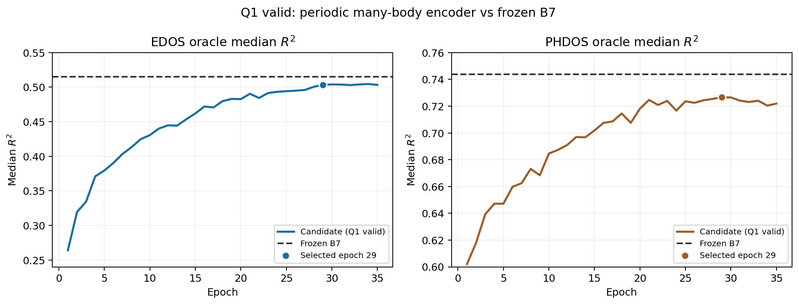

# 日志：2026-09-29 — 周期多体局部—全局 Encoder，Q1 valid 单候选实验

状态：**单候选完成；未通过预设 Q1 valid 门槛，park，不采用**。执行方案见[冻结设计](../design/design-periodic-manybody-encoder-proposal.md)。本实验只检验一个完整 encoder 架构包，不单独归因于角通道、Q/K/V 投影、图半径或参数量。

## 问题、对照和执行边界

- 假设：让方向 `l=1,2` 原子状态跨三个局部块保留，再回流到不变标量内容，可能改善晶体结构对 eDOS 谱形的条件作用。
- 对照：冻结的 Q1 B7 `_e9ctl`，M1×35，seed 42，按原 valid 综合分数选出 epoch 33。候选从头训练，保留原双谱 decoder/head、SumNorm 谱损失、H1 eta/gamma 尺度头及输入契约。
- 候选配方：Q1 train 18,706、valid 2,313，M1×35、seed 42、batch 32、学习率 `5e-5`、FP32、非分桶、SumNorm、H1 eta；只用 train/valid 训练和选点，运行参数包含 `--skip_test_eval`。不追加第二架构、种子或超参搜索。
- 两臂总参数：B7 `71,152,964`，候选 `75,901,511`；encoder 分别为 `14,383,104` 与 `19,131,651`。这些是模型实例的参数计数，表明容量也属于本架构包的变化。

## 实现与合同

- [`model/periodic_manybody.py`](../../model/periodic_manybody.py) 的 `periodic_edge_vectors` 按 G2 完整周期镜像与位移重建笛卡尔边向量；`EquivariantLocalBlock` 用 `e3nn` 张量积、径向门控、稀疏聚合和跨层方向状态；`GlobalAtomLayer` 使用独立学习的 Q/K/V；`PeriodicManyBodyEncoder` 将三个局部块与六层全局原子注意力交替，并只向现有 decoder 输出 `[B,L,512]` memory。
- [`model/transformer.py`](../../model/transformer.py) 以默认关闭的 `use_periodic_manybody` 路径接入；B7 原 encoder 保留。`utils/experiment_config.py` 和 `run_ablation_experiments.py` 将开关写入配置与检查点运行记录，并拒绝与 G1/G2 同时使用。
- [`tests/test_periodic_manybody.py`](../../tests/test_periodic_manybody.py) 验证多镜像边向量长度、完整模型对原子重排/整格平移/晶胞基底重表达的一致性，以及方向张量积路径到 eDOS 的非零梯度。三个合同测试通过；接入仓库静态检查后，既有静态脚本共 182 项通过。冻结 B7 epoch 33 的权重严格载入默认路径通过。

## Q1 图与资源门

- [全量 4.5 Å 边审计](../../results/periodic_manybody_edge_audit_q1.csv)覆盖 train 18,706 与 valid 2,313 条。每样本边数中位均为 `138`；train/valid p99 分别约 `1,456/1,734`，最大 `3,464/3,896`。最大原子入度的每样本 p99 均为 `50`，全局最大 `80/70`。
- 图构建没有异常，但 train 有 `53` 条、valid 有 `9` 条结构没有 4.5 Å 局部边，其中多于一个原子的分别为 `39/9` 条。这些样本仍经过全局主干，但局部几何通路无法提供信息，是结果解释的边界。
- [V100 资源门](../../results/periodic_manybody_resource_gate_v100.json)在真实 batch 32 上分别测随机代表批与含最大训练图的压力批，使用 3 次预热、8 次计时的单步中位数。候选为 `0.271/0.273 s`，B7 为 `0.321/0.321 s`；最大比值 `0.849×`。候选峰值分配显存最多 `4.759 GB`，低于预定的 `24 GB`，两项资源门均通过。更早的仅 2 次计时试测出现较大波动并给出 STOP，随后扩大预热和计时次数复核；训练依据的是复核后的固定脚本与记录。

## 训练、Q1 valid 判读与结论

- 35 轮全部完成，进程退出码 `0`；[训练历史](../../results/history_m1_pmb1.csv)累计 `5,837.8 s`，平均 `166.8 s/epoch`，训练峰值显存约 `4.58 GB`。日志明确记录 `Test loader and automatic test evaluation skipped by request`。按既定综合 valid 分数选中候选 epoch 29（分数 `0.670097`）；eDOS 单项最高的 epoch 34 **没有**被另行挑选。
- [正式判读](../../results/periodic_manybody_q1_valid_verdict.json)对两臂全体 2,313 条 Q1 valid 同序计算，冻结 B7 epoch 33 的 eDOS oracle/blind 逐样本 R²与既有记录在 `2e-5` 容差内重合。表中 Δ 为候选减 B7；区间为 2,000 次逐样本配对 bootstrap 的中位差 95% 百分位区间。失败定义为 R² `< 0`，Δ失败率单位为百分点。

| 任务/模式 | B7 中位 R² | 候选中位 R² | Δ中位 R² [95% 区间] | B7 → 候选失败率 | Δ失败率 |
|---|---:|---:|---:|---:|---:|
| eDOS oracle | 0.51498 | 0.50334 | −0.01164 [−0.02066, −0.00398] | 6.27% → 7.18% | +0.908 |
| eDOS blind | 0.47314 | 0.46038 | −0.01276 [−0.02097, −0.00250] | 9.12% → 10.55% | +1.427 |
| phDOS oracle | 0.74380 | 0.72664 | −0.01716 [−0.02698, −0.01062] | 3.80% → 3.93% | +0.130 |
| phDOS blind | 0.73787 | 0.71605 | −0.02182 [−0.03025, −0.01298] | 4.37% → 4.76% | +0.389 |

- **预设门槛判决：**eDOS oracle 的主科学门未过，blind 部署门未过（其中 blind 失败率增加超过 1 个百分点），phDOS 保护门也未过（blind 中位 R²下降超过 0.02）。所以不追加复现或角通道消融，不替换默认 B7。本次没有读取 test 选型；历史项目工作曾查看 test，故也不把 test 称为全新独立留出集。
- [同组成 320 对逐对结果](../../results/periodic_manybody_q1_valid_pairs.csv)：目标谱差 TV 中位 `0.26975`；B7 预测 `0.01604`，候选仅 `0.00033`。谱差误差 TV 中位从 B7 的 `0.26685` 增至候选的 `0.26979`。候选有 `256/320` 对的预测 TV 小于 `0.001`，仅 `22/320` 对比 B7 更大；320 对中只有 7 对含零局部边样本，因此零边情况不能单独解释这种普遍的同组成响应收缩。这是机制读出，不参与选点或门槛判决。
- 训练曲线显示候选的 eDOS/phDOS valid 指标前期持续上升，约第 25 轮后收益放缓；这只能说明此配方下未达到 B7，不能证明所有方向/角度表示无用。候选同时改变了全局几何打分、注意力 Q/K/V、局部半径和容量，现有实验无法单独定位负收益的原因。

## 产物与验证边界

- 模型检查点：`output/ablation_m1_pmb1/checkpoint_best.pth`（epoch 29），完整运行日志：`results/periodic_manybody_training.log`；两者保留，不提交或删除。
- [逐样本指标](../../results/periodic_manybody_q1_valid_samples.csv)列出两臂及其差值；[逐对指标](../../results/periodic_manybody_q1_valid_pairs.csv)与判读 JSON 可复核表格。
- 代码合同、静态检查和文档引用验证见本日志实现段；这些检查不等同于多种子复现。此结论只关闭 `4.5 Å`、当前通道宽度、35 轮 Q1 配方下的这个完整候选。
