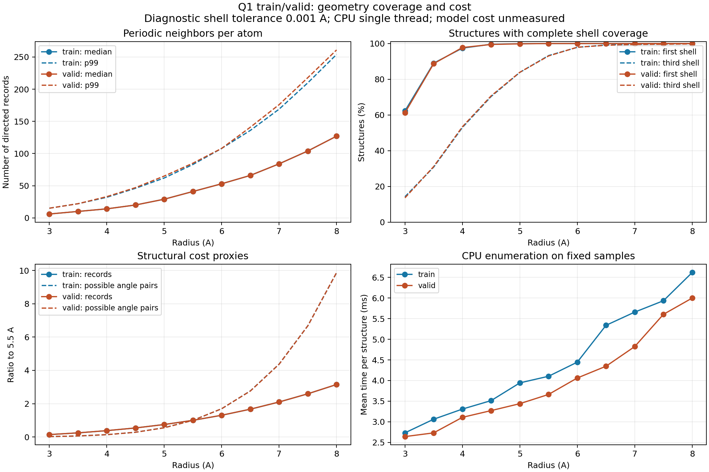

# 周期邻域半径的结构审查

日期：2026-10-03。状态：全量结构统计与核对已完成；用户已确定下一轮几何验收采用 6.0 Å。
记录规范见 [`design-periodic-neighbor-records.md`](../design/design-periodic-neighbor-records.md)。

## 范围与口径

- 仅使用 Q1 train 18,706、valid 2,313 个结构的元素、晶格、分数坐标和样本编号；不加载
  test、eDOS/phDOS 标签或 checkpoint，不执行模型前向或训练。blind/oracle 指标不适用于本项。
- 全量扫描前固定诊断半径集合：3.0、3.5、4.0、4.5、5.0、5.5、6.0、6.5、7.0、7.5、8.0 Å。
  集合用于比较覆盖与成本，不构成模型超参数的采用决定；4.5、5.5 Å 同时用于核对历史计数。
- 复用 [`build_g2_edges`](../../utils/g2_periodic_edges.py) 在最大候选半径枚举，再以严格 `d<R`
  筛选各候选记录；复用 `g2_indegrees`，计数包括多镜像和跨胞自身邻居，无 top-k。
- 每个中心的距离从小到大排序，以每组首距离为锚点，归组到 `首距离+容差`，不做链式合并。
  取前三组，要求整组满足 `d<R` 才计为完整覆盖。主容差为 0.001 Å，另报 0.01 Å 敏感性；
  这是距离壳层的诊断定义，不是已经确定的角度编码或物理作用范围。
- 若最大候选半径未完整解析前三组，自适应扩张参考半径，最多 32 Å；仍未解析的组标为截尾，
  不将它解释为没有邻居，不计为已认证完整覆盖。参考扩张仅用于壳层定位。
- 报告原子加权入度、每结构记录数、空邻域、前三组完整覆盖的原子及结构比例；结构可形成的
  无序邻边对数与六字段存储量仅作成本代理，不表示已经采用显式键角枚举或某个模型架构。

## 入口与预算

入口：[`periodic_neighbor_radius_audit.py`](../../tools/eval/periodic_neighbor_radius_audit.py)。
仅准备此诊断入口，历史 `g2_edge_audit.py` 与模型函数保持原样。

使用 CPU、float32、单线程。train/valid 各 33 个预检结构在 8 Å 下约需 0.20 秒，估计全量
最大半径枚举合计约 126 秒；壳层统计、输出与独立半径计时另计。每个划分固定等间隔 64 个
结构，另加入最大原子数、最小奇异值和最多记录的结构，所有候选使用相同样本，计时重复三次。
计时仅包含边枚举，不推断 GPU、完整模型、训练时间或显存。

数据预检：两个划分的晶格与有效槽坐标均有限，恢复晶胞的长度与奇异值检查通过。
审查入口还会检查输入哈希、拒绝零距离异原子记录，并报告失败样本而非静默删除。

## 验证与产物

[`test_periodic_neighbor_radius_audit.py`](../../tests/test_periodic_neighbor_radius_audit.py) 验证
正有限半径、train/valid 边界、有效槽 NaN 拒绝、立方晶胞解析计数、严格边界、参考扩张与
截尾、非链式壳层分组、多半径筛选与直接枚举一致、重合异原子拒绝。

上述 7 项 CPU 测试通过。全量审查耗时 220.09 秒，进程峰值内存 471.93 MiB；最大候选半径
的实际枚举时间合计约 95.95 秒，其余为输入检查、壳层统计、明细输出、汇总与独立计时等。
未发现非有限输入或零距离异原子记录。train/valid 分别 21/5 个结构扩大参考半径到 12 Å，
两个容差下所有原子的前三组均已解析，无参考截尾。

产物目录：[`periodic_neighbor_radius_q1_20261003`](../../results/periodic_neighbor_radius_q1_20261003/)。

- [汇总 CSV](../../results/periodic_neighbor_radius_q1_20261003/summary.csv)、
  [完整摘要](../../results/periodic_neighbor_radius_q1_20261003/summary.json)、
  [执行与输入/源码哈希](../../results/periodic_neighbor_radius_q1_20261003/manifest.json)。
- [原子明细](../../results/periodic_neighbor_radius_q1_20261003/atoms.csv.gz)：train/valid
  219,505/27,437 行；[结构与半径明细](../../results/periodic_neighbor_radius_q1_20261003/structures.csv.gz)
  共 231,209 行，均保留样本编号与索引。
- [CPU 独立计时](../../results/periodic_neighbor_radius_q1_20261003/cpu_benchmark.csv)：各划分实际
  67 个固定结构、11 个半径、每项三次；1,474 项直接枚举的记录数与最大半径筛选结果一致。
- [复核记录](../../results/periodic_neighbor_radius_q1_20261003/verification.json)：从原子和结构
  明细独立汇总，核对记录总数、入度中位数/p99、空邻域、壳层覆盖和邻边对数，均与摘要一致；
  输入及执行源码哈希未变。4.5/5.5 Å 分别对照
  [历史周期多体计数](../../results/periodic_manybody_edge_audit_q1.csv)和
  [历史 G2 计数](../../results/g2_edge_audit_q1.csv)，每个半径的 21,019 个结构的原子数、记录数、
  最大入度均一致。历史文件中的 test 行不参与比较或选型。

复现入口（拒绝覆盖已有目录，重跑时指定新的输出目录）：

```sh
python -B tools/eval/periodic_neighbor_radius_audit.py --radii 3 3.5 4 4.5 5 5.5 6 6.5 7 7.5 8 --out-dir results/periodic_neighbor_radius_q1_recheck
python -B tools/eval/plot_periodic_neighbor_radius_audit.py --audit-dir results/periodic_neighbor_radius_q1_recheck
```

## 数据结果与半径取舍

下表摘取关键候选，完整 11 个半径见产物。每格按 train/valid 顺序；壳层主容差为 0.001 Å，
“前三组完整覆盖”要求一个结构的全部有效原子的前三组距离邻居均满足严格 `d<R`。

| R（Å） | 空邻域原子数 | 第一组完整覆盖结构（%） | 前三组完整覆盖结构（%） | 原子入度中位数 |
|---|---|---|---|---|
| 4.5 | 226 / 45 | 99.583 / 99.481 | 70.341 / 70.687 | 20 / 20 |
| 5.5 | 11 / 0 | 99.968 / 100.000 | 93.243 / 93.039 | 41 / 41 |
| 6.0 | 0 / 0 | 100.000 / 100.000 | 97.867 / 97.925 | 53 / 53 |
| 6.5 | 0 / 0 | 100.000 / 100.000 | 99.161 / 99.006 | 66 / 66 |
| 7.0 | 0 / 0 | 100.000 / 100.000 | 99.540 / 99.481 | 84 / 84 |
| 8.0 | 0 / 0 | 100.000 / 100.000 | 99.888 / 99.784 | 127 / 127 |

| R（Å） | 总记录数相对 5.5 Å | 潜在无序邻边对数相对 5.5 Å | 入度 p99 | 固定样本 CPU 平均枚举（ms/结构） |
|---|---|---|---|---|
| 5.5 | 1.000 / 1.000 | 1.000 / 1.000 | 83 / 85 | 4.104 / 3.664 |
| 6.0 | 1.303 / 1.306 | 1.696 / 1.699 | 108 / 108 | 4.446 / 4.062 |
| 6.5 | 1.670 / 1.671 | 2.770 / 2.764 | 136 / 141 | 5.338 / 4.347 |
| 7.0 | 2.101 / 2.102 | 4.377 / 4.372 | 169 / 176 | 5.658 / 4.823 |
| 8.0 | 3.150 / 3.154 | 9.867 / 9.876 | 254 / 261 | 6.617 / 5.998 |



事实：6.0 Å 是已检查的 0.5 Å 网格中，同时使 train/valid 无空邻域并完整覆盖第一组的最小候选。
第一组上界最大值为 train 5.58379 Å、valid 5.44234 Å；5.5 Å 的遗漏集中在 train 的 6 个结构、
11 个原子，样本明细可追溯。6.0 Å 并不意味着连续半径上的最小值已确定，也不意味着三组在
每个结构上都完整覆盖。

容差敏感性：改用 0.01 Å，6.0 Å 的前三组完整覆盖结构比例为 97.733/97.752%，6.5 Å 为
99.145/99.006%；两个候选都保留第一组的全覆盖。壳层定义变化对这两个候选的上述结构比例
最大影响约 0.173 个百分点；整个半径网格的第三组最大差异约 4.021 个百分点，不能将距离
分组视为唯一的物理壳层定义。

决定（2026-10-03，用户：“那就先定6.0埃”）：阶段性采用 **6.0 Å** 进行下一轮几何验收，
显式传入 `R=6.0 Å`，保留严格 `d<R` 和半径内全部周期镜像。它解决所检查数据中的空邻域，
相对 5.5 Å 记录数增加约 30%，前三组完整覆盖结构由约 93% 增至约 97.9%。作为取舍依据，
**6.5 Å** 相对 6.0 Å 再增加约 28% 记录、63% 潜在邻边对，前三组结构覆盖增加约
1.1–1.3 个百分点至约 99%。用户选择了 6.0 Å 的覆盖与成本折中；99% 未被规定为采用门槛。

结构覆盖不能证明 eDOS/phDOS 所需的作用范围或预测收益。CPU 计时不代表新 Encoder 的
计算成本，邻边对数不表示必须显式枚举角度；扰动结构、完整几何等价验收、模型对称性与
train/valid 预测收益仍待后续工作。本次没有改模型半径或训练配置。
